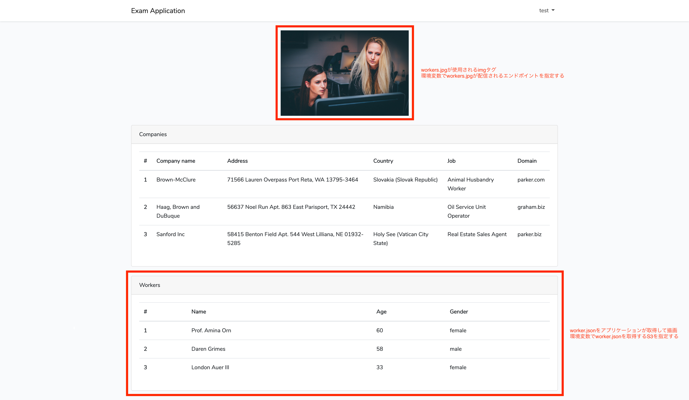

# 試験用のアセット

以下の2つのファイルをこのリポジトリのルートディレクリからダウンロードして使用してください

* workers.json
* workers.jpg

## workers.jsonの使い方

ルートディレクリの `workers.json` を任意のS3のルートディレクトリにアップロードしてください。

試験用のアプリケーションがS3から `workers.json` を取得し、描画します。

試験で指定されたAMIを起動する際、ユーザーデータに `export AWS_BUCKET=` でS3の名前を環境変数に設定することでアプリケーションがJSONファイルを取得をします。 

## workers.jpgの使い方

ルートディレクリの `workers.jpg` を任意のS3の `/assets/images` 配下にアップロードしてください。

試験用のアプリケーションから配信されたHTMLのimgタグに `worker.jpg` が使用されます。

試験で指定されたAMIを起動する際、ユーザーデータに `export ASSETS_ENDPOINT=` で 画像が配信されるエンドポイントを環境変数に設定することでHTMLのimgタグにそのエンドポイントが埋め込まれます。

